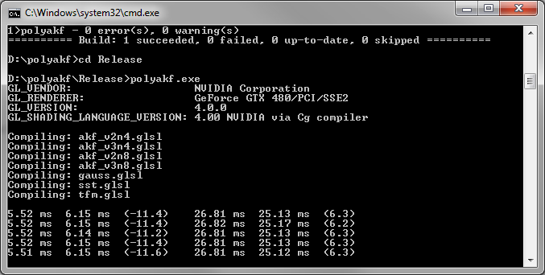

# polyakf

Anisotropic Kuwahara Filtering with Polynomial Weighting Functions

This program implements a simple benchmark for the anisotropic Kuwahara filter with texture-based weighting functions and the anisotropic Kuwahara filter with polynomial weighting functions. It was written by [Jan Eric Kyprianidis](http://www.kyprianidis.com/) while working as a research scientist for the [computer graphics systems group](http://www.hpi3d.de/) of the [Hasso-Plattner-Institut](http://www.hpi.uni-potsdam.de/) at the University of Potsdam, Germany. For details see (Kyprianidis & et al., 2010).

## Building

Currently only Windows and building with Visual Studio 2008 is supported. See build.bat to get started.

## Related Publications

* Kyprianidis, J. E., Semmo, A., Kang, H., & Döllner, J. (2010). [Anisotropic Kuwahara Filtering with Polynomial Weighting Functions](http://www.kyprianidis.com/p/tpcg2010/). In Proc. EG UK Theory and Practice of Computer Graphics.
